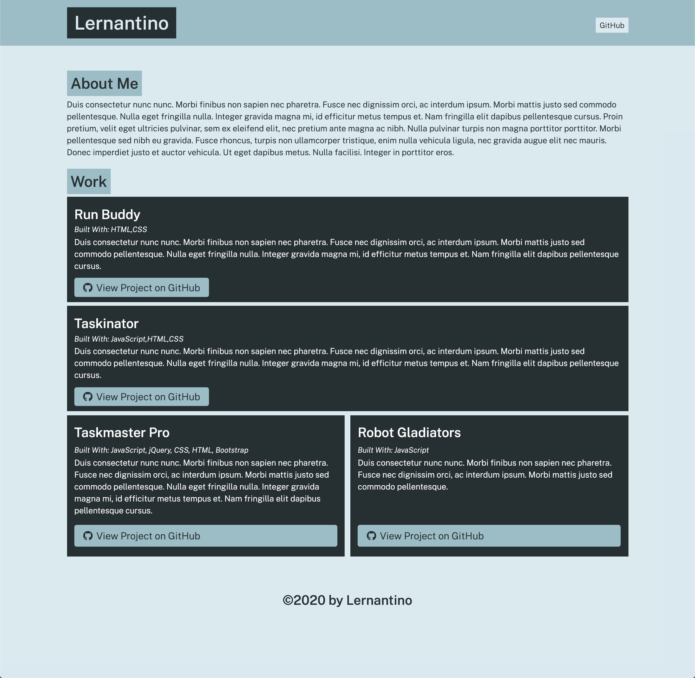

# Portfolio Generator
  [](https://github.com/katiechurchwell/portfolio-generator)
  [](https://github.com/katiechurchwell/portfolio-generator)


## Summary


Dynamically generates an HTML portfolio page based on user prompts from the command-line. Built with Node.js and [Inquirer.js](https://github.com/SBoudrias/Inquirer.js). 

## Example of Generated Page



## Installation
Clone the repository to your machine.

## Usage
- Run ```node app``` in the terminal
- Follow the prompts
- Navigate to your generated page: ```dist/index.html```

## Questions
  If you have any questions about this project, please open an issue or use the contact information below:
  * [katiechurchwell](https://www.github.com/katiechurchwell)
  * [churchwellcatherine@gmail.com](mailto:churchwellcatherine@gmail.com)


---
  